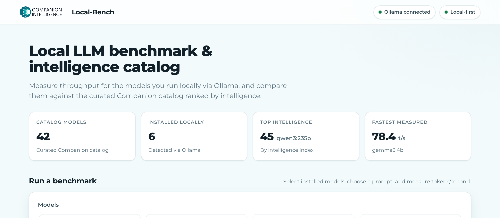
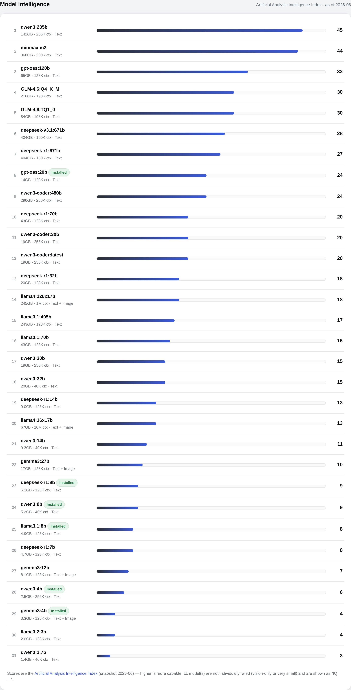
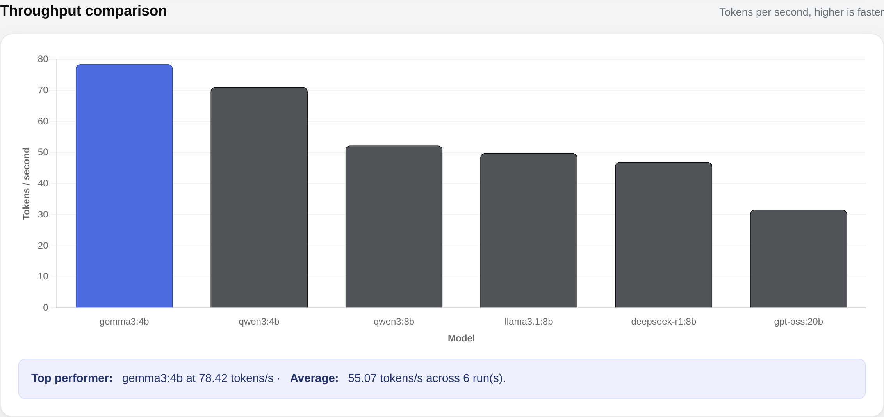
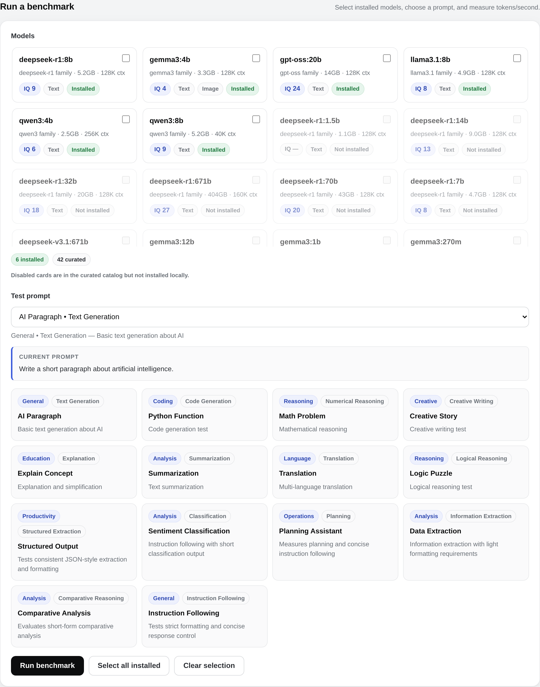
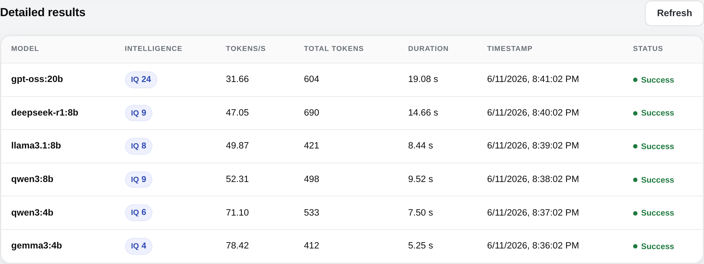

# Local-Bench

**A [Companion Intelligence](https://ci.computer/) app for benchmarking local LLMs — and comparing them by intelligence.**

Local-Bench measures the token-generation speed of models you run locally (via [Ollama](https://ollama.ai/) or AMD STRIX Halo / llama.cpp) and presents the results in a clean, local-first web dashboard. It also ships a curated Companion model catalog ranked by the **Artificial Analysis Intelligence Index**, so you can weigh capability against the throughput your hardware actually delivers.



## Screenshots

| Model intelligence catalog | Throughput comparison |
| --- | --- |
|  |  |

| Run a benchmark | Detailed results |
| --- | --- |
|  |  |

> Full-page view: [`docs/screenshots/01-overview.png`](docs/screenshots/01-overview.png)

## Features

- 📊 Benchmark multiple local LLMs and measure **tokens per second** for each
- 🧠 **Model intelligence catalog** — curated Companion models ranked by the Artificial Analysis Intelligence Index, shown alongside size, context window, and modality
- 🧪 A broad prompt library (coding, reasoning, extraction, planning, summarization, translation, instruction-following) plus custom prompts
- 💾 Results stored in SQLite (`benchmark_data.db`) and CSV (`benchmark_results.csv`)
- 💻 Captures system specifications (CPU, memory, OS, GPU, STRIX Halo) with every run
- 🎮 **AMD STRIX Halo** GPU support for `llama.cpp` benchmarking
- 🪶 **Local-first** — Chart.js is vendored into the repo, so the dashboard renders fully offline (it gracefully falls back to CSS bar charts if scripting is unavailable)
- 🎨 Styled to match the **Companion Intelligence Hub design system** — light colorway, teal accents, Montserrat, and the official CI logo banner

## Prerequisites

- [Node.js](https://nodejs.org/) (v18 or higher)
- **For Ollama benchmarks:** [Ollama](https://ollama.ai/) running locally with at least one model pulled
- **For AMD STRIX Halo benchmarks:** an AMD Ryzen AI Max "Strix Halo" APU — see [STRIX_HALO.md](STRIX_HALO.md)

## Quick start

```bash
git clone https://github.com/companionintelligence/Local-Bench.git
cd Local-Bench
npm install

# make sure Ollama is running (default http://localhost:11434)
ollama serve

# build + start the dashboard
npm start
# open http://localhost:3000
```

Don't have Ollama running yet? The dashboard still loads — it shows the curated catalog and intelligence scores, and degrades gracefully (see [First run / no Ollama](#first-run--no-ollama)).

## Usage

### Run benchmarks from the CLI

```bash
# Benchmark the curated catalog
npm run benchmark

# Benchmark specific installed models
node dist/benchmark.js llama3.2:3b qwen3:8b gemma3:4b

# Point at a non-default Ollama
OLLAMA_API_URL=http://192.168.1.50:11434 npm run benchmark
```

### Run benchmarks from the web UI

```bash
npm start          # http://localhost:3000
PORT=8080 npm start  # custom port
```

The dashboard lets you pick installed models, choose a prompt (or write your own), run benchmarks, and watch results, charts, statistics, and system specs update live.

### AMD STRIX Halo

```bash
npm run strix-halo detect
npm run strix-halo setup llama-rocm-7.2
npm run strix-halo benchmark /path/to/model.gguf --toolbox llama-rocm-7.2
```

Full guide: [STRIX_HALO.md](STRIX_HALO.md).

## Model intelligence scores

Each curated model carries an **intelligence score** sourced from the
[Artificial Analysis Intelligence Index](https://artificialanalysis.ai/) — a
composite benchmark (MMLU-Pro, GPQA Diamond, LiveCodeBench, AIME, and more)
scored roughly 0–100 where higher is more capable. The dashboard surfaces it as
an `IQ` badge on each model and as a ranked "Model intelligence" list.

A few notes on the data:

- Scores are a **snapshot** (currently `2026-06`) and are version-sensitive — the index evolves as new evaluations and models are added.
- **Vision-only** (`-vl`) variants and very small models are not individually rated by the index and appear as **"Not rated" / `IQ —`**.
- The values are a best-effort public reference and are intended to be **easy to override** with Companion's own curated numbers. They live in a single place — the `intelligenceIndex` field of `SUPPORTED_OLLAMA_MODELS` in [`src/benchmark.ts`](src/benchmark.ts) — which both the CLI and UI read from. The attribution shown in the UI comes from `INTELLIGENCE_INDEX_SOURCE` / `INTELLIGENCE_INDEX_URL` / `INTELLIGENCE_INDEX_AS_OF` in the same file.

## Docker / Companion Intelligence Hub

Local-Bench is published as a public, multi-architecture (amd64 + arm64) container image and runs as a first-party app on the Companion Intelligence Hub.

**Image:** `ghcr.io/companionintelligence/ci-local-bench:latest`

```bash
docker run -d -p 3000:3000 ghcr.io/companionintelligence/ci-local-bench:latest
# open http://localhost:3000
```

Point it at an Ollama server with `OLLAMA_API_URL` (inside a container, `localhost` is the container itself):

```bash
# Ollama on the Docker host
docker run -d -p 3000:3000 \
  -e OLLAMA_API_URL=http://host.docker.internal:11434 \
  ghcr.io/companionintelligence/ci-local-bench:latest

# Ollama on the LAN
docker run -d -p 3000:3000 \
  -e OLLAMA_API_URL=http://192.168.1.50:11434 \
  ghcr.io/companionintelligence/ci-local-bench:latest
```

Benchmark data (`benchmark_data.db` + `benchmark_results.csv`) is written to the working directory (`/app` in the container). Mount a volume there to persist results across restarts.

### First run / no Ollama

The dashboard degrades gracefully when there's no data and no reachable Ollama:

- It loads and shows a friendly welcome instead of a red error banner.
- The **Model intelligence** catalog still renders (scores come from the bundled catalog, not Ollama).
- The model picker falls back to the curated catalog and notes that Ollama is unavailable; `GET /api/models` returns HTTP `503` with the catalog body.
- System specs, statistics, and the chart show neutral "run a benchmark" placeholders until results exist.

## API endpoints

| Endpoint | Description |
| --- | --- |
| `GET /api/models` | Curated catalog merged with installed Ollama models (incl. `intelligenceIndex`). `503` + catalog body if Ollama is unreachable. |
| `GET /api/prompts` | The benchmark prompt library |
| `GET /api/results` | All stored benchmark results |
| `GET /api/system-specs` | Latest captured system specifications |
| `GET /api/results-with-specs?limit=N` | Results joined with their system specs |
| `GET /api/meta` | Intelligence-score attribution (source, URL, snapshot date) |
| `POST /api/run-benchmark` | Run a benchmark `{ models: string[], promptId?, customPrompt? }` |

## Output (CSV)

```csv
Model,Tokens Per Second,Total Tokens,Duration (s),Timestamp,Status
gemma3:4b,78.42,412,5.25,2026-06-11T20:36:02.000Z,Success
qwen3:8b,52.31,498,9.52,2026-06-11T20:38:02.000Z,Success
```

## Configuration

Edit [`src/benchmark.ts`](src/benchmark.ts) to customize:

- `OLLAMA_API_URL` — Ollama endpoint (env var, default `http://localhost:11434`)
- `TEST_PROMPTS` — the benchmark prompt library
- `SUPPORTED_OLLAMA_MODELS` — the curated catalog, including each model's `intelligenceIndex`

## Testing

```bash
npm test            # Jest unit tests (server, benchmark, database, system specs, STRIX Halo)
npm run test:coverage
npm run build       # typecheck + emit to dist/
```

The repository is set up for automated testing:

- **Unit tests** cover the API, the catalog/intelligence data, CSV/DB writes, and system-spec collection.
- **Container smoke test** — [`tests/container/`](tests/container) is a self-contained Playwright harness that boots the published image and asserts the web UI renders, saving a screenshot artifact. It runs in the GHCR publish workflow.
- **Screenshots** in [`docs/screenshots/`](docs/screenshots) are captured against the running server (see that workflow / the Playwright harness) and embedded above.

## Troubleshooting

**Cannot connect to Ollama:** ensure `ollama serve` is running and reachable at `http://localhost:11434`, or set `OLLAMA_API_URL`.

**Model not found:** list installed models with `ollama list`, then `ollama pull <model-name>`.

**Benchmark takes too long:** larger models are slower; there's a 2-minute per-model timeout. Benchmark fewer/smaller models at once.

**Chart not showing:** the dashboard automatically falls back to CSS bar charts if the vendored Chart.js can't execute — no internet required.

## Contributing

Contributions are welcome — please open a Pull Request.

## Supported Companion catalog

Curated models with their Artificial Analysis Intelligence Index score (snapshot `2026-06`; `—` = not individually rated).

<!-- The table below is generated from SUPPORTED_OLLAMA_MODELS in src/benchmark.ts -->

| Model | Size | Context | Inputs | Intelligence |
| --- | --- | --- | --- | --- |
| gemma3:270m | 292MB | 32K | Text | — |
| qwen3:0.6b | 523MB | 40K | Text | — |
| gemma3:1b | 815MB | 32K | Text | — |
| deepseek-r1:1.5b | 1.1GB | 128K | Text | — |
| llama3.2:1b | 1.3GB | 128K | Text | — |
| qwen3:1.7b | 1.4GB | 40K | Text | 3 |
| qwen3-vl:2b | 1.9GB | 256K | Text, Image | — |
| llama3.2:3b | 2.0GB | 128K | Text | 4 |
| qwen3:4b | 2.5GB | 256K | Text | 6 |
| gemma3:4b | 3.3GB | 128K | Text, Image | 4 |
| qwen3-vl:4b | 3.3GB | 256K | Text, Image | — |
| deepseek-r1:7b | 4.7GB | 128K | Text | 8 |
| llama3.1:8b | 4.9GB | 128K | Text | 8 |
| deepseek-r1:8b | 5.2GB | 128K | Text | 9 |
| qwen3:8b | 5.2GB | 40K | Text | 9 |
| qwen3-vl:8b | 6.1GB | 256K | Text, Image | — |
| gemma3:12b | 8.1GB | 128K | Text, Image | 7 |
| deepseek-r1:14b | 9.0GB | 128K | Text | 13 |
| qwen3:14b | 9.3GB | 40K | Text | 11 |
| gpt-oss:20b | 14GB | 128K | Text | 24 |
| gemma3:27b | 17GB | 128K | Text, Image | 10 |
| qwen3-coder:latest | 19GB | 256K | Text | 20 |
| qwen3-coder:30b | 19GB | 256K | Text | 20 |
| qwen3:30b | 19GB | 256K | Text | 15 |
| deepseek-r1:32b | 20GB | 128K | Text | 18 |
| qwen3:32b | 20GB | 40K | Text | 15 |
| qwen3-vl:30b | 20GB | 256K | Text, Image | — |
| qwen3-vl:32b | 21GB | 256K | Text, Image | — |
| deepseek-r1:70b | 43GB | 128K | Text | 20 |
| llama3.1:70b | 43GB | 128K | Text | 16 |
| gpt-oss:120b | 65GB | 128K | Text | 33 |
| llama4:16x17b | 67GB | 10M | Text, Image | 13 |
| GLM-4.6:TQ1_0 | 84GB | 198K | Text | 30 |
| qwen3:235b | 142GB | 256K | Text | 45 |
| qwen3-vl:235b | 143GB | 256K | Text, Image | — |
| GLM-4.6:Q4_K_M | 216GB | 198K | Text | 30 |
| llama3.1:405b | 243GB | 128K | Text | 17 |
| llama4:128x17b | 245GB | 1M | Text, Image | 18 |
| qwen3-coder:480b | 290GB | 256K | Text | 24 |
| deepseek-v3.1:671b | 404GB | 160K | Text | 28 |
| deepseek-r1:671b | 404GB | 160K | Text | 27 |
| minmax m2 | 968GB | 200K | Text | 44 |

---

> **Private & Confidential — Property of Lifescope Inc. Do not distribute.**
