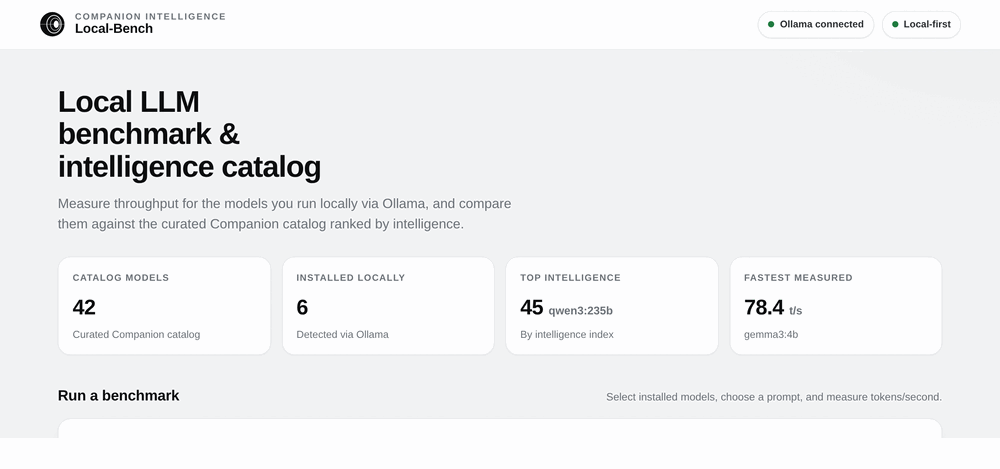

# Local-Bench

A [Companion Intelligence](https://ci.computer/) app for benchmarking local LLMs and comparing them by intelligence.

Local-Bench measures how the language models on your own machine perform. It runs a prompt against one or more models served by [Ollama](https://ollama.ai/), records how fast each model generates text, and shows the results in a local web dashboard with tables, charts, and side by side response comparison. You can also run it from the command line and export a PDF report.

Everything runs locally. Your prompts and the model responses stay on your machine.




## Screenshots

| Model intelligence catalog | Throughput comparison |
| --- | --- |
|  |  |

| Run a benchmark | Detailed results |
| --- | --- |
|  |  |

Full page view: [`docs/screenshots/01-overview.png`](docs/screenshots/01-overview.png)

## What it does

- Benchmarks any model installed in Ollama and reports tokens per second, total tokens, and duration.
- Shows a curated catalog of popular models with sizes, context windows, and an intelligence score, so you can compare capability alongside speed.
- Lets you pick a built in prompt, edit it, or write your own before running.
- Shows two model responses at a time so you can read them next to each other.
- Captures your system specs (CPU, memory, OS, GPU) with every run.
- Exports a PDF report with the results table, your system summary, and the full model responses.
- Includes an optional path for benchmarking AMD Strix Halo GPUs with llama.cpp.

## Why it is useful

1. Choose the right model for your hardware. See which models run fast enough on your machine before you build them into a workflow.
2. Balance speed against quality. Compare tokens per second against the intelligence score to find the best tradeoff for your needs.
3. Measure a hardware change. Benchmark before and after adding a GPU or more memory to see how much faster inference gets.
4. Compare two models on the same prompt. Read both answers side by side to judge which model responds better for your task.
5. Share findings. Export a PDF with the numbers, system specs, and responses to send to a teammate or attach to a writeup.

## Requirements

- [Node.js](https://nodejs.org/) version 18 or higher.
- [Ollama](https://ollama.ai/) running locally with at least one model pulled.
- Optional: an AMD Ryzen AI Max "Strix Halo" machine for the llama.cpp GPU path. See [STRIX_HALO.md](STRIX_HALO.md).

## Quick start

```bash
git clone https://github.com/companionintelligence/Local-Bench.git
cd Local-Bench
npm install

# start Ollama if it is not already running (default http://localhost:11434)
ollama serve

# pull a model or two if you have not already
ollama pull llama3.2:3b
ollama pull qwen3:8b

# build and start the dashboard
npm start
# open http://localhost:3000
```

If Ollama is not running yet, the dashboard still loads. It shows the curated catalog and intelligence scores and tells you to start Ollama when you want to run a benchmark.

## Using the web dashboard

```bash
npm start             # http://localhost:3000
PORT=8080 npm start   # custom port
```

In the dashboard you can select installed models, choose and edit a prompt, run a benchmark, watch the charts and results update, compare two responses, and export a PDF.

## Running from the command line

```bash
# benchmark the curated catalog
npm run benchmark

# benchmark specific installed models
node dist/benchmark.js llama3.2:3b qwen3:8b gemma3:4b

# point at a non default Ollama
OLLAMA_API_URL=http://192.168.1.50:11434 npm run benchmark
```

## AMD Strix Halo benchmarks

```bash
npm run strix-halo detect
npm run strix-halo setup llama-rocm-7.2
npm run strix-halo benchmark /path/to/model.gguf --toolbox llama-rocm-7.2
```

See [STRIX_HALO.md](STRIX_HALO.md) for the full guide.

## Run it with Docker

Local-Bench is published as a multi architecture (amd64 and arm64) container image and runs as a first party app on the Companion Intelligence Hub.

```bash
docker run -d -p 3000:3000 ghcr.io/companionintelligence/ci-local-bench:latest
# open http://localhost:3000
```

Point it at your Ollama server with `OLLAMA_API_URL`. Inside a container, `localhost` is the container itself, so use the host address:

```bash
docker run -d -p 3000:3000 \
  -e OLLAMA_API_URL=http://host.docker.internal:11434 \
  ghcr.io/companionintelligence/ci-local-bench:latest
```

Benchmark data is written to the working directory (`/app` in the container). Mount a volume there to keep results across restarts.

## Where results are stored

- `benchmark_results.csv` is a flat record of every run.
- `benchmark_data.db` is a SQLite database with results and system specs.

## Model intelligence scores

Each curated model carries an intelligence score from the [Artificial Analysis Intelligence Index](https://artificialanalysis.ai/), a composite benchmark scored roughly 0 to 100 where higher is more capable. The dashboard shows it as an IQ badge on each model and as a ranked list. Scores are a snapshot and can change as the index evolves. Vision only and very small models are not individually rated and appear as "Not rated". The full catalog is browsable in the app and defined in [`src/benchmark.ts`](src/benchmark.ts).

## Configuration

Edit [`src/benchmark.ts`](src/benchmark.ts) to customize:

- `OLLAMA_API_URL`, the Ollama endpoint (also an environment variable, default `http://localhost:11434`).
- `TEST_PROMPTS`, the benchmark prompt library.
- `SUPPORTED_OLLAMA_MODELS`, the curated catalog and each model's intelligence score.

## Testing

```bash
npm test              # Jest unit tests
npm run test:coverage
npm run build         # typecheck and emit to dist/
```

## Troubleshooting

- Cannot connect to Ollama: make sure `ollama serve` is running and reachable at `http://localhost:11434`, or set `OLLAMA_API_URL`.
- Model not found: list installed models with `ollama list`, then pull what you need with `ollama pull <model>`.
- A run takes too long: each model has a two minute timeout. Benchmark fewer or smaller models at a time.

## Links

- Documentation: https://docs.ci.computer/
- Discord community: https://discord.com/invite/yQp9hwpzAa

## Contributing

Contributions are welcome. Please open a Pull Request.

## Confidentiality

Private and Confidential. Property of Lifescope Inc. Do not distribute.
