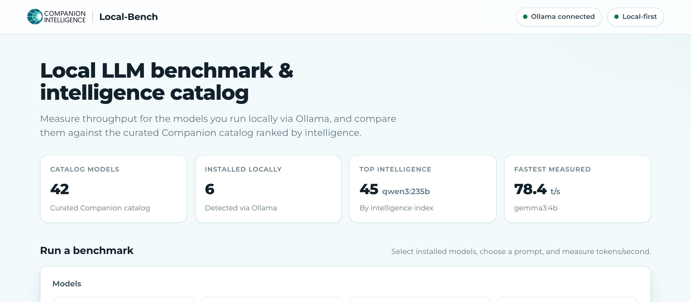
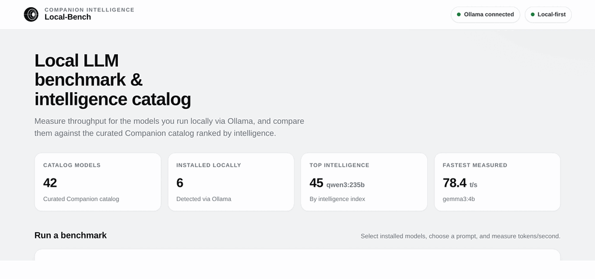
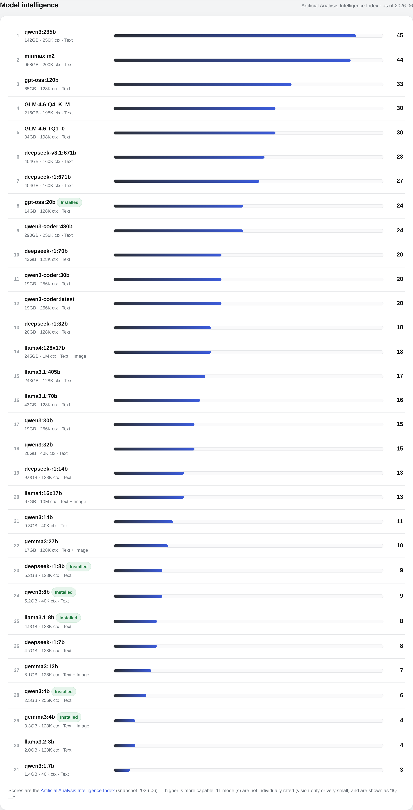
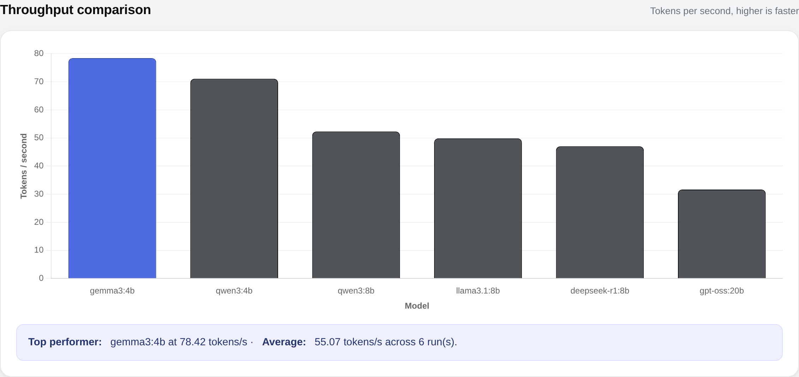
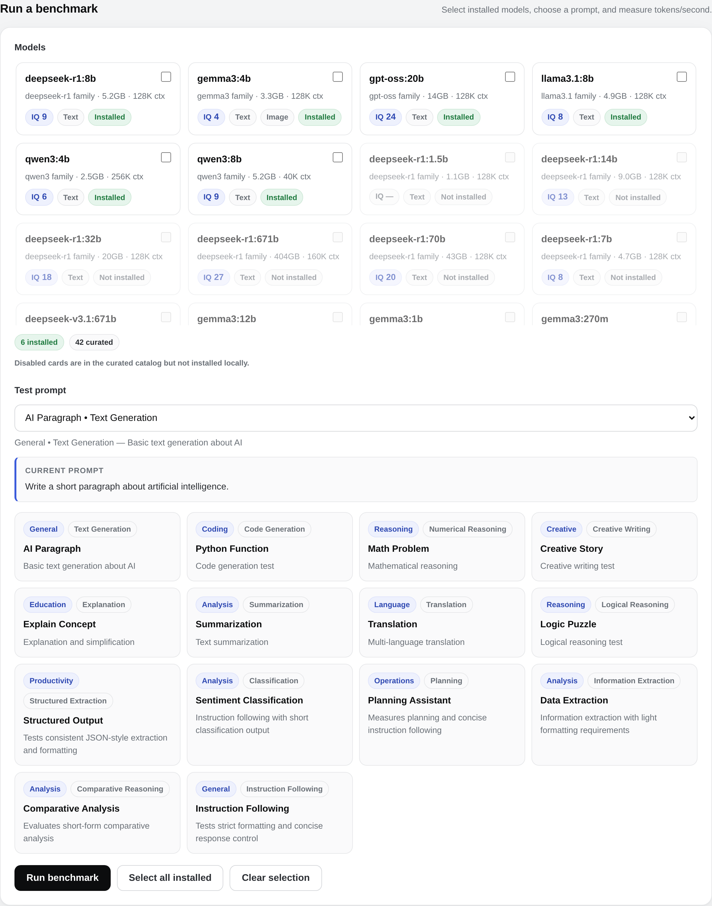
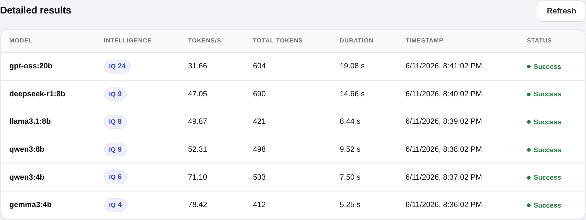

# Local-Bench

A [Companion Intelligence](https://ci.computer/) app for benchmarking local LLMs and comparing them by intelligence.

Local-Bench measures how the language models on your own machine perform. It runs a prompt against one or more models served by [Ollama](https://ollama.ai/), records how fast each model generates text, and shows the results in a local web dashboard with tables, charts, and side by side response comparison. You can also run it from the command line and export a PDF report.

Everything runs locally. Your prompts and the model responses stay on your machine.





## Screenshots

| Model intelligence catalog | Throughput comparison |
| --- | --- |
|  |  |

| Run a benchmark | Detailed results |
| --- | --- |
|  |  |

Full page view: [`docs/screenshots/01-overview.png`](docs/screenshots/01-overview.png)

## What it does

- Benchmarks any model installed in Ollama and reports tokens per second, total tokens, and duration.
- Benchmarks a [CI-Hub](https://github.com/companionintelligence/CI-Hub) inference pool the way an installed app sees it: fires N requests at once, records which node and engine answered each one, and reports time to first token, decode speed, and aggregate throughput.
- Shows a curated catalog of popular models with sizes, context windows, and an intelligence score, so you can compare capability alongside speed.
- Lets you pick a built in prompt, edit it, or write your own before running.
- Shows two model responses at a time so you can read them next to each other.
- Captures your system specs (CPU, memory, OS, GPU) with every run.
- Exports a PDF report with the results table, your system summary, and the full model responses.
- Includes an optional path for benchmarking AMD Strix Halo GPUs with llama.cpp.

## Why it is useful

1. Choose the right model for your hardware. See which models run fast enough on your machine before you build them into a workflow.
2. Balance speed against quality. Compare tokens per second against the intelligence score to find the best tradeoff for your needs.
3. Measure a hardware change. Benchmark before and after adding a GPU or more memory to see how much faster inference gets.
4. Compare two models on the same prompt. Read both answers side by side to judge which model responds better for your task.
5. Share findings. Export a PDF with the numbers, system specs, and responses to send to a teammate or attach to a writeup.

## Requirements

- [Node.js](https://nodejs.org/) version 22.5 or higher (needed for the built-in `node:sqlite` module), or [Deno](https://deno.com/) 2.9+ — see [Running under Deno](#running-under-deno).
- [Ollama](https://ollama.ai/) running locally with at least one model pulled, or a reachable [CI-Hub](https://github.com/companionintelligence/CI-Hub) inference pool (see [Benchmarking a CI-Hub pool](#benchmarking-a-ci-hub-pool)).
- Optional: an AMD Ryzen AI Max "Strix Halo" machine for the llama.cpp GPU path. See [STRIX_HALO.md](STRIX_HALO.md).

## Quick start

```bash
git clone https://github.com/companionintelligence/Local-Bench.git
cd Local-Bench
npm install

# start Ollama if it is not already running (default http://localhost:11434)
ollama serve

# pull a model or two if you have not already
ollama pull llama3.2:3b
ollama pull qwen3:8b

# build and start the dashboard
npm start
# open http://localhost:3000
```

If Ollama is not running yet, the dashboard still loads. It shows the curated catalog and intelligence scores and tells you to start Ollama when you want to run a benchmark.

## Using the web dashboard

```bash
npm start             # http://localhost:3000
PORT=8080 npm start   # custom port
```

In the dashboard you can select installed models, choose and edit a prompt, run a benchmark, watch the charts and results update, compare two responses, and export a PDF.

## Running from the command line

```bash
# benchmark the curated catalog
npm run benchmark

# benchmark specific installed models
node dist/benchmark.js llama3.2:3b qwen3:8b gemma3:4b

# point at a non default Ollama
OLLAMA_API_URL=http://192.168.1.50:11434 npm run benchmark

# fire four requests at once and report the batch aggregate
node dist/benchmark.js gemma3:4b --concurrency=4

# one request at a time, no streaming (no TTFT; matches the old numbers exactly)
node dist/benchmark.js gemma3:4b --no-stream
```

## Benchmarking a CI-Hub pool

A CI-Hub exposes its inference pool at `{hub}/api/inference/pool`. It speaks Ollama's API (`/api/tags`, `/api/generate`) and OpenAI's (`/v1/chat/completions`) and routes each request to whichever node in the pool has the model loaded. Point Local-Bench at it and the tool measures throughput from an app's seat: the same path a marketplace app takes, including the routing decision.

```bash
# a pool on the tailnet
OLLAMA_API_URL=http://100.115.174.32:5002/api/inference/pool node dist/benchmark.js gemma3:1b --concurrency=4

# the same, as the dashboard
OLLAMA_API_URL=http://100.115.174.32:5002/api/inference/pool npm start
```

Inside a Hub-installed app you do not need to set anything once the marketplace manifest maps the Hub's resolved inference endpoint onto these variables (`APP_OLLAMA_URL` → `OLLAMA_API_URL`, `APP_OPENAI_BASE_URL` → `CI_LLM_BASE_URL`, `APP_OPENAI_API_KEY` → `CI_LLM_API_KEY`; see `CI-Marketplace/apps/ci-local-bench/docker-compose.json`). `OLLAMA_API_URL` wins whenever it is non-empty, so an Ollama-backed Hub benchmarks through its pool with native timings and a vLLM/Lemonade-backed Hub falls through to the OpenAI transport.

### Environment

| Variable | Meaning | Default |
| --- | --- | --- |
| `OLLAMA_API_URL` | Ollama-native base URL. May be a pool proxy. Wins when set. | `http://localhost:11434` |
| `CI_LLM_BASE_URL` | OpenAI-compatible base URL, with or without a trailing `/v1`. Used when `OLLAMA_API_URL` is unset or empty. | unset |
| `CI_LLM_API_KEY` | Sent as `Authorization: Bearer` on every request when set. | unset |
| `BENCH_TRANSPORT` | Force `ollama` or `openai`. Otherwise the tool probes `GET {base}/api/tags` once: answers means Ollama-native, anything else means OpenAI-compatible. | auto |
| `PORT` | Dashboard port. | `3000` |

The OpenAI transport is how you reach an engine directly rather than through the pool: vLLM at `http://host:8000`, Lemonade at `http://host:13305`, Lucebox at `http://host:8216`. Those have no `/api/generate`, so set `CI_LLM_BASE_URL` (or `OLLAMA_API_URL`, either works) to the engine's base and the tool uses `/v1/chat/completions`.

### Concurrency

`--concurrency=N` (CLI) or the concurrency selector (dashboard) sends N identical requests at the same instant and waits for all of them. N is clamped to 1..16. Every row in the batch shares a `batchId`, and the batch gets one aggregate row.

Concurrency is the interesting knob for a pool. A single request measures one node. Four at once show whether the pool spreads them across nodes (each row's `servedBy` names the node, `backend` names the engine) and what the whole pool delivers per second.

### What the numbers mean

- **tok/s** (`tokensPerSecond`) is generated tokens divided by wall-clock time for that request, including queueing, routing, model load, and prompt processing. This is the number the tool has always reported and the one old CSVs and charts compare against. Under concurrency it drops, because each request waits its turn.
- **TTFT** (`ttftMs`) is milliseconds from sending the request to the first content chunk. Only measured when streaming (the default). This is the latency a user feels before text starts appearing; on a pool it includes the routing hop and any model load on the chosen node.
- **Decode tok/s** (`decodeTokensPerSecond`) is the engine's generation speed with everything before the first token excluded. On Ollama it is `eval_count / eval_duration` from the response's own timings; on an OpenAI-compatible engine it is tokens over the time after TTFT. This is the number to compare engines and hardware on, since it is insensitive to load time and queueing.
- **Aggregate tok/s** (`aggregateTokensPerSecond`) is the sum of all tokens in a batch divided by the batch's wall time. This is the pool's throughput: what N simultaneous apps would get out of it together. Compare it against the concurrency-1 number to see how much the pool scales.
- **Served by / backend** come from the `X-Hub-Pool-Served-By` and `X-Hub-Pool-Backend` response headers the pool adds (`local` or a peer's MagicDNS name; `ollama`, `vllm`, `lemonade`, `lucebox`, `dspark`, or `mtplx`). They are empty on a direct Ollama or engine target. `requestId` is `X-Hub-Pool-Request-Id`, useful for finding the request in the Hub's logs.
- **Load / prompt eval / eval** (`loadMs`, `promptEvalMs`, `evalMs`) are Ollama's own timing breakdown, in milliseconds. Only present on the Ollama transport.

The CLI prints one line per request and then an `=` line with the batch aggregate:

```
Benchmarking gemma3:1b (4 concurrent, streaming, ollama → http://100.115.174.32:5002/api/inference/pool)...
  ✓ gemma3:1b: 2.13s, 107 tokens, 50.19 tokens/second
  ...
    50.19 tok/s wall, 89.94 tok/s decode, TTFT 945ms, served by core-4.capybara-ulmer.ts.net, backend ollama
  = aggregate 50.92 tok/s over 7.92s, 4/4 ok, median TTFT 3436ms, median decode 92.87 tok/s, served by beta-1…×1 core-4…×1 fzzy…×1 core-17…×1, backends ollama×4
```

The dashboard shows the same: a banner naming the target and whether it is a pool, pool columns in the results table when the rows have them, and an aggregate throughput panel with the served-by distribution.

### API

The dashboard's server exposes these for scripts:

- `GET /api/target` → `{ url, transport, path, pool }`; `path` is `pool` when the URL contains `/inference/pool`, and `pool.servedByHeaderSeen` says whether the pool has answered this process yet.
- `POST /api/run-benchmark` with `{ models, promptId?, customPrompt?, concurrency?, stream? }` → `{ success, results, aggregates }`.
- `GET /api/results` → every stored row, new fields `null` on rows written before them.
- `GET /api/aggregates?limit=N` → recent batch aggregates.

This tool measures throughput over time from the app's side. Conformance of the pool's wire protocol is the job of the fleet harness in CI-Engineering; the two are meant to be run together, not instead of each other.

## AMD Strix Halo benchmarks

```bash
npm run strix-halo detect
npm run strix-halo setup llama-rocm-7.2
npm run strix-halo benchmark /path/to/model.gguf --toolbox llama-rocm-7.2
```

See [STRIX_HALO.md](STRIX_HALO.md) for the full guide.

## Run it with Docker

Local-Bench is published as a multi architecture (amd64 and arm64) container image and runs as a first party app on the Companion Intelligence Hub.

```bash
docker run -d -p 3000:3000 ghcr.io/companionintelligence/ci-local-bench:latest
# open http://localhost:3000
```

Point it at your Ollama server with `OLLAMA_API_URL`. Inside a container, `localhost` is the container itself, so use the host address:

```bash
docker run -d -p 3000:3000 \
  -e OLLAMA_API_URL=http://host.docker.internal:11434 \
  ghcr.io/companionintelligence/ci-local-bench:latest
```

Benchmark data is written to the working directory (`/app` in the container). Mount a volume there to keep results across restarts.

## Where results are stored

- `benchmark_results.csv` is a flat record of every run (the six original columns only).
- `benchmark_data.db` is a SQLite database with results, batch aggregates, and system specs. An older database is migrated in place when the tool opens it; the pool columns are `NULL` on rows that predate them.

## Model intelligence scores

Each curated model carries an intelligence score from the [Artificial Analysis Intelligence Index](https://artificialanalysis.ai/), a composite benchmark scored roughly 0 to 100 where higher is more capable. The dashboard shows it as an IQ badge on each model and as a ranked list. Scores are a snapshot and can change as the index evolves. Vision only and very small models are not individually rated and appear as "Not rated". The full catalog is browsable in the app and defined in [`src/benchmark.ts`](src/benchmark.ts).

## Configuration

Edit [`src/benchmark.ts`](src/benchmark.ts) to customize:

- `OLLAMA_API_URL` / `CI_LLM_BASE_URL`, the inference endpoint (environment variables; see [Benchmarking a CI-Hub pool](#benchmarking-a-ci-hub-pool)).
- `TEST_PROMPTS`, the benchmark prompt library.
- `SUPPORTED_OLLAMA_MODELS`, the curated catalog and each model's intelligence score.

## Testing

```bash
npm test              # Jest unit tests
npm run test:coverage
npm run build         # typecheck and emit to dist/
```

## Running under Deno

This repo also runs under [Deno](https://deno.com/) (2.9+) via its npm/Node
compatibility layer — `deno.json` mirrors the npm scripts above as tasks:

```bash
deno task build         # tsc -> dist/
deno task server        # build + serve on :3000
deno task start          # same as server
deno task benchmark      # build + run the CLI benchmark
deno task strix-halo     # build + run the Strix Halo CLI
deno task test           # runs the existing Jest suite under Deno
deno task test:watch
deno task test:coverage
deno task lint            # deno lint (stricter defaults than the repo's ts-jest/tsc setup; pre-existing findings aren't all fixed yet)
```

The database layer uses Node's built-in `node:sqlite` module rather than
`better-sqlite3`, since better-sqlite3's native addon does not load under
Deno. `node:sqlite` works the same way under Node (>=22.5) and Deno, so the
npm scripts and the `deno task` equivalents share the same `src/database.ts`
with no forked code path.

The published container image (`ghcr.io/companionintelligence/ci-local-bench`)
now builds and runs on `denoland/deno` instead of `node`; see the
[`Dockerfile`](Dockerfile).

## Troubleshooting

- Cannot connect to Ollama: make sure `ollama serve` is running and reachable at `http://localhost:11434`, or set `OLLAMA_API_URL`.
- Model not found: list installed models with `ollama list`, then pull what you need with `ollama pull <model>`.
- A run takes too long: each model has a two minute timeout. Benchmark fewer or smaller models at a time.

## Links

- Documentation: https://docs.ci.computer/
- Discord community: https://discord.com/invite/yQp9hwpzAa

## Contributing

Contributions are welcome. Please open a Pull Request.

## Confidentiality

Private and Confidential. Property of Lifescope Inc. Do not distribute.
